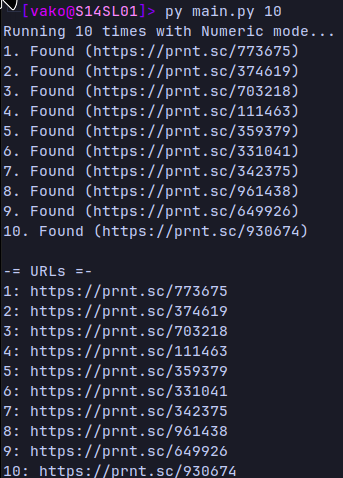

# Lightshot Scraper
# About
I remembered that you could see random screenshots on
 the [Lightshot](https://prnt.sc/) website,
 but many of them have been deleted, so I created
 this script so that my friend and I can find screenshots
 that haven't been deleted



# How to use
## Install the requirements
```bash
pip install -r requirements.txt # You may have to use "pip3" instead

# OR

python3 -m pip install -r requirements.txt
```


## Usage
```bash
python3 main.py [amnt=1-20] [type=0-2]
```

- `amnt` - The amount of scraped URLs (*a number between **1** and **20***)
- `type` - What type of URL se
	+ `0` - Numeric (*e.g.: **17263***) **[DEFAULT]**
	+ `1` - Alphanumeric (*e.g.: **8q73fh***)
	+ `2` - Random (*50/50 one of above for each query*)
